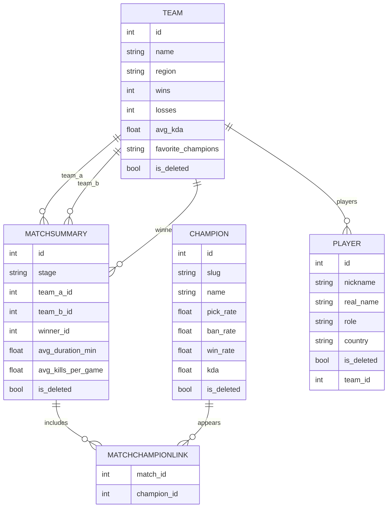

---

# 🎮 LoL Worlds API

**Autor:** Joel Marín
**Universidad:** Universidad Católica de Colombia
**Programa:** Ingeniería de Sistemas
**Versión:** 1.0.0
**Framework:** FastAPI + SQLModel
**Base de datos:** SQLite

---

## Tabla de contenidos

* [Descripción general](#descripción-general)
* [Objetivos del proyecto](#objetivos-del-proyecto)
* [Tecnologías utilizadas](#tecnologías-utilizadas)
* [Modelado de datos](#modelado-de-datos)

  * [Champion](#champion)
  * [Team](#team)
  * [MatchSummary](#matchsummary)
  * [Relaciones (ERD)](#relaciones-erd)
* [Instalación y ejecución](#instalación-y-ejecución)
* [Mapa de endpoints](#mapa-de-endpoints)

  * [Champions](#champions)
  * [Teams](#teams)
  * [Matches](#matches)
* [Reglas de negocio](#reglas-de-negocio)

---

## Descripción general

**LoL Worlds API** es un backend en **FastAPI** para gestionar y analizar información del **Campeonato Mundial de League of Legends (LoL Worlds)**. Permite **registrar, consultar, filtrar, restaurar** y **eliminar lógicamente** datos de:

* **Campeones (Champion)**
* **Equipos (Team)**
* **Partidas (MatchSummary)**

Pensado como base para una **guía analítica** con estadísticas y tendencias competitivas. Emplea **SQLModel** (Pydantic + SQLAlchemy) y **SQLite** para persistencia.

---

## Objetivos del proyecto

**Objetivo general**
Desarrollar una API REST que gestione información relacionada con campeones, equipos y partidas del Mundial de League of Legends, integrando relaciones entre modelos y operaciones CRUD completas con control lógico de los registros.

**Objetivos específicos**

* Implementar relaciones **1:N** y **N:M** con SQLModel.
* Crear endpoints CRUD con **manejo de excepciones** y **soft delete**.
* Habilitar **búsquedas** y **filtrados** por atributos.
* Mantener **historial** y **restauración** de registros eliminados.
* Dejar la base para **reportes exportables (CSV, XLSX, PDF)**.

---

## Tecnologías utilizadas

| Tecnología   | Descripción                     |
| ------------ | ------------------------------- |
| FastAPI      | Framework principal del backend |
| SQLModel     | ORM (Pydantic + SQLAlchemy)     |
| SQLite       | Base de datos ligera y embebida |
| Uvicorn      | Servidor ASGI                   |
| Pydantic     | Validación de datos             |
| Python 3.11+ | Lenguaje de programación        |

---

## Modelado de datos

### Champion

| Atributo     | Tipo  | Descripción                                     |
| ------------ | ----- | ----------------------------------------------- |
| `id`         | int   | PK autoincremental (no editable por el usuario) |
| `slug`       | str   | Alias único del campeón                         |
| `name`       | str   | Nombre del campeón                              |
| `pick_rate`  | float | Frecuencia de selección                         |
| `ban_rate`   | float | Frecuencia de bloqueo                           |
| `win_rate`   | float | Porcentaje de victorias                         |
| `kda`        | float | Promedio de kills/deaths/assists                |
| `is_deleted` | bool  | Eliminación lógica (soft delete)                |

### Team

| Atributo             | Tipo  | Descripción                 |
| -------------------- | ----- | --------------------------- |
| `id`                 | int   | PK autoincremental          |
| `name`               | str   | Nombre del equipo           |
| `region`             | str   | Región (LCK, LPL, LEC, LCS) |
| `wins`               | int   | Número de victorias         |
| `losses`             | int   | Número de derrotas          |
| `avg_kda`            | float | KDA promedio del equipo     |
| `favorite_champions` | str   | Campeones más usados (CSV)  |
| `is_deleted`         | bool  | Eliminación lógica          |

**Relaciones:** 1:N con `MatchSummary` como `team_a`, `team_b` y `winner`.

### MatchSummary

| Atributo             | Tipo  | Descripción                           |
| -------------------- | ----- | ------------------------------------- |
| `id`                 | int   | PK autoincremental                    |
| `stage`              | str   | Etapa (ej. “Playoffs”, “Worlds 2025”) |
| `team_a_id`          | int   | FK → Team                             |
| `team_b_id`          | int   | FK → Team                             |
| `winner_id`          | int   | FK → Team (equipo ganador)            |
| `avg_duration_min`   | float | Duración promedio (min)               |
| `avg_kills_per_game` | float | Kills promedio por partida            |
| `is_deleted`         | bool  | Eliminación lógica                    |

**Relaciones:**

* `Team` (1:N)
* `Champion` (N:M) vía tabla de enlace `MatchChampionLink(match_id, champion_id)`

### Relaciones (ERD)



> **Nota:** Los rótulos son descriptivos para el diagrama y no afectan el esquema real.

---

## Instalación y ejecución

```bash
# 1) Clonar el repo
git clone https://github.com/tu-usuario/lol-worlds-api.git
cd lol-worlds-api

# 2) Crear entorno virtual (ejemplo en Windows PowerShell)
python -m venv .venv
. .venv/Scripts/Activate.ps1

# 3) Instalar dependencias
pip install -r requirements.txt

# 4) Ejecutar el servidor (recomendado)
uvicorn main:app --reload

# Alternativa si usas FastAPI CLI (requiere fastapi[standard] instalado)
# fastapi dev main.py
```

* Documentación interactiva: **`http://127.0.0.1:8000/docs`** (Swagger UI)
* ReDoc: **`http://127.0.0.1:8000/redoc`**

> Si tuviste errores con `fastapi dev`, usa `uvicorn main:app --reload`.

---

## Mapa de endpoints

### Champions

| Método   | Ruta                                        | Descripción                             |
| -------- | ------------------------------------------- | --------------------------------------- |
| `POST`   | `/champions/`                               | Crear un nuevo campeón                  |
| `GET`    | `/champions/`                               | Listar campeones activos                |
| `GET`    | `/champions/{id}`                           | Obtener un campeón por ID               |
| `PUT`    | `/champions/{id}`                           | Actualizar información de un campeón    |
| `DELETE` | `/champions/{id}`                           | Eliminar (soft delete)                  |
| `GET`    | `/champions/deleted`                        | Listar campeones eliminados (historial) |
| `POST`   | `/champions/{id}/restore`                   | Restaurar campeón eliminado             |
| `GET`    | `/champions/search?nombre={name}`           | Buscar campeón por nombre               |
| `GET`    | `/champions/filter/winrate?min_winrate={x}` | Filtrar por tasa de victoria mínima     |

### Teams

| Método   | Ruta                       | Descripción                        |
| -------- | -------------------------- | ---------------------------------- |
| `POST`   | `/teams/`                  | Crear equipo                       |
| `GET`    | `/teams/`                  | Listar equipos activos             |
| `GET`    | `/teams/{id}`              | Obtener equipo por ID              |
| `PUT`    | `/teams/{id}`              | Actualizar equipo                  |
| `DELETE` | `/teams/{id}`              | Eliminar (soft delete)             |
| `GET`    | `/teams/deleted`           | Historial de eliminados            |
| `POST`   | `/teams/{id}/restore`      | Restaurar equipo                   |
| `GET`    | `/teams/search?region=LCK` | Buscar por región                  |
| `GET`    | `/teams/{id}/matches`      | Partidas donde participa el equipo |

### Matches

| Método   | Ruta                             | Descripción                            |
| -------- | -------------------------------- | -------------------------------------- |
| `POST`   | `/matches/`                      | Crear partida                          |
| `GET`    | `/matches/`                      | Listar partidas activas                |
| `GET`    | `/matches/{id}`                  | Obtener partida por ID                 |
| `DELETE` | `/matches/{id}`                  | Eliminar (soft delete)                 |
| `GET`    | `/matches/deleted`               | Historial de partidas eliminadas       |
| `POST`   | `/matches/{id}/restore`          | Restaurar partida eliminada            |
| `GET`    | `/matches/search?etapa=Playoffs` | Buscar partidas por etapa              |
| `GET`    | `/matches/winner/{team_id}`      | Filtrar partidas ganadas por un equipo |

### Players

| Método   | Ruta                              | Descripción                          |
| -------- | --------------------------------- | ------------------------------------ |
| `POST`   | `/players/`                       | Crear jugador                        |
| `GET`    | `/players/`                       | Listar jugadores activos             |
| `GET`    | `/players/{id}`                   | Obtener jugador por ID               |
| `PUT`    | `/players/{id}`                   | Actualizar información de un jugador |
| `DELETE` | `/players/{id}`                   | Eliminar (soft delete)               |
| `GET`    | `/players/deleted`                | Historial de jugadores eliminados    |
| `POST`   | `/players/{id}/restore`           | Restaurar jugador eliminado          |
| `GET`    | `/players/search?nickname={name}` | Buscar jugador por nickname          |
| `GET`    | `/players/role/{role}`            | Filtrar jugadores por rol            |
| `GET`    | `/players/team/{team_id}`         | Filtrar jugadores por equipo         |


---

## Reglas de negocio

* **Soft delete:** no se elimina físicamente; se marca `is_deleted = True`.
* **Historial:** endpoints `/deleted` listan registros eliminados.
* **Restauración:** endpoints `/restore` revierten `is_deleted` a `False`.
* **Consultas limpias:** por defecto omiten `is_deleted = True`.
* **IDs autoincrementales:** no son editables por el cliente.
* **Manejo de errores:** respuestas coherentes (400, 404, 409, 500) con mensajes claros.

---


