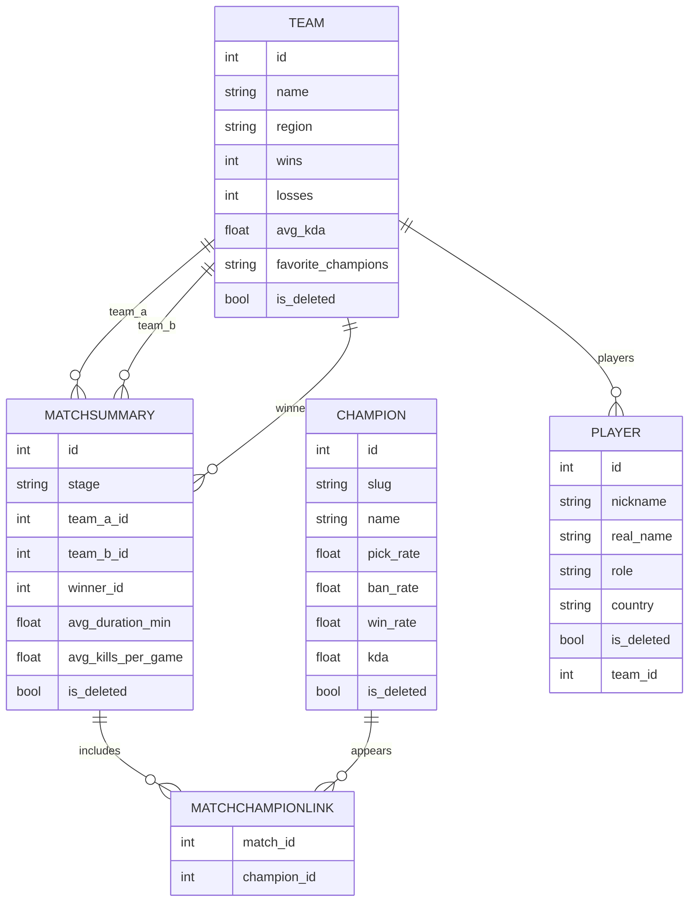

---

# 🎮 LoL Worlds API

**Autor:** Joel Marín
**Universidad:** Universidad Católica de Colombia
**Programa:** Ingeniería de Sistemas
**Versión:** 1.0.0
**Framework:** FastAPI + SQLModel
**Base de datos:** SQLite

---

## Tabla de contenidos

* [Descripción general](#descripción-general)
* [Objetivos del proyecto](#objetivos-del-proyecto)
* [Tecnologías utilizadas](#tecnologías-utilizadas)
* [Modelado de datos](#modelado-de-datos)

  * [Champion](#champion)
  * [Team](#team)
  * [MatchSummary](#matchsummary)
  * [Relaciones (ERD)](#relaciones-erd)
* [Instalación y ejecución](#instalación-y-ejecución)
* [Mapa de endpoints](#mapa-de-endpoints)

  * [Champions](#champions)
  * [Teams](#teams)
  * [Matches](#matches)
* [Reglas de negocio](#reglas-de-negocio)

---

## Descripción general

**LoL Worlds API** es un backend en **FastAPI** para gestionar y analizar información del **Campeonato Mundial de League of Legends (LoL Worlds)**. Permite **registrar, consultar, filtrar, restaurar** y **eliminar lógicamente** datos de:

* **Campeones (Champion)**
* **Equipos (Team)**
* **Partidas (MatchSummary)**

Pensado como base para una **guía analítica** con estadísticas y tendencias competitivas. Emplea **SQLModel** (Pydantic + SQLAlchemy) y **SQLite** para persistencia.

---

## Objetivos del proyecto

**Objetivo general**
Desarrollar una API REST que gestione información relacionada con campeones, equipos y partidas del Mundial de League of Legends, integrando relaciones entre modelos y operaciones CRUD completas con control lógico de los registros.

**Objetivos específicos**

* Implementar relaciones **1:N** y **N:M** con SQLModel.
* Crear endpoints CRUD con **manejo de excepciones** y **soft delete**.
* Habilitar **búsquedas** y **filtrados** por atributos.
* Mantener **historial** y **restauración** de registros eliminados.
* Dejar la base para **reportes exportables (CSV, XLSX, PDF)**.

---

## Tecnologías utilizadas

| Tecnología   | Descripción                     |
| ------------ | ------------------------------- |
| FastAPI      | Framework principal del backend |
| SQLModel     | ORM (Pydantic + SQLAlchemy)     |
| SQLite       | Base de datos ligera y embebida |
| Uvicorn      | Servidor ASGI                   |
| Pydantic     | Validación de datos             |
| Python 3.11+ | Lenguaje de programación        |

---

## Modelado de datos

### Champion

| Atributo     | Tipo  | Descripción                                     |
| ------------ | ----- | ----------------------------------------------- |
| `id`         | int   | PK autoincremental (no editable por el usuario) |
| `slug`       | str   | Alias único del campeón                         |
| `name`       | str   | Nombre del campeón                              |
| `pick_rate`  | float | Frecuencia de selección                         |
| `ban_rate`   | float | Frecuencia de bloqueo                           |
| `win_rate`   | float | Porcentaje de victorias                         |
| `kda`        | float | Promedio de kills/deaths/assists                |
| `is_deleted` | bool  | Eliminación lógica (soft delete)                |

### Team

| Atributo             | Tipo  | Descripción                 |
| -------------------- | ----- | --------------------------- |
| `id`                 | int   | PK autoincremental          |
| `name`               | str   | Nombre del equipo           |
| `region`             | str   | Región (LCK, LPL, LEC, LCS) |
| `wins`               | int   | Número de victorias         |
| `losses`             | int   | Número de derrotas          |
| `avg_kda`            | float | KDA promedio del equipo     |
| `favorite_champions` | str   | Campeones más usados (CSV)  |
| `is_deleted`         | bool  | Eliminación lógica          |

**Relaciones:** 1:N con `MatchSummary` como `team_a`, `team_b` y `winner`.

### MatchSummary

| Atributo             | Tipo  | Descripción                           |
| -------------------- | ----- | ------------------------------------- |
| `id`                 | int   | PK autoincremental                    |
| `stage`              | str   | Etapa (ej. “Playoffs”, “Worlds 2025”) |
| `team_a_id`          | int   | FK → Team                             |
| `team_b_id`          | int   | FK → Team                             |
| `winner_id`          | int   | FK → Team (equipo ganador)            |
| `avg_duration_min`   | float | Duración promedio (min)               |
| `avg_kills_per_game` | float | Kills promedio por partida            |
| `is_deleted`         | bool  | Eliminación lógica                    |

**Relaciones:**

* `Team` (1:N)
* `Champion` (N:M) vía tabla de enlace `MatchChampionLink(match_id, champion_id)`

### Relaciones (ERD)



> **Nota:** Los rótulos son descriptivos para el diagrama y no afectan el esquema real.

---

## Instalación y ejecución

```bash
# 1) Clonar el repo
git clone https://github.com/tu-usuario/lol-worlds-api.git
cd lol-worlds-api

# 2) Crear entorno virtual (ejemplo en Windows PowerShell)
python -m venv .venv
. .venv/Scripts/Activate.ps1

# 3) Instalar dependencias
pip install -r requirements.txt

# 4) Ejecutar el servidor (recomendado)
uvicorn main:app --reload

# Alternativa si usas FastAPI CLI (requiere fastapi[standard] instalado)
# fastapi dev main.py
```

* Documentación interactiva: **`http://127.0.0.1:8000/docs`** (Swagger UI)
* ReDoc: **`http://127.0.0.1:8000/redoc`**

> Si tuviste errores con `fastapi dev`, usa `uvicorn main:app --reload`.

---

## Mapa de endpoints

### Champions

| Método   | Ruta                                        | Descripción                             |
| -------- | ------------------------------------------- | --------------------------------------- |
| `POST`   | `/champions/`                               | Crear un nuevo campeón                  |
| `GET`    | `/champions/`                               | Listar campeones activos                |
| `GET`    | `/champions/{id}`                           | Obtener un campeón por ID               |
| `PUT`    | `/champions/{id}`                           | Actualizar información de un campeón    |
| `DELETE` | `/champions/{id}`                           | Eliminar (soft delete)                  |
| `GET`    | `/champions/deleted`                        | Listar campeones eliminados (historial) |
| `POST`   | `/champions/{id}/restore`                   | Restaurar campeón eliminado             |
| `GET`    | `/champions/search?nombre={name}`           | Buscar campeón por nombre               |
| `GET`    | `/champions/filter/winrate?min_winrate={x}` | Filtrar por tasa de victoria mínima     |

### Teams

| Método   | Ruta                       | Descripción                        |
| -------- | -------------------------- | ---------------------------------- |
| `POST`   | `/teams/`                  | Crear equipo                       |
| `GET`    | `/teams/`                  | Listar equipos activos             |
| `GET`    | `/teams/{id}`              | Obtener equipo por ID              |
| `PUT`    | `/teams/{id}`              | Actualizar equipo                  |
| `DELETE` | `/teams/{id}`              | Eliminar (soft delete)             |
| `GET`    | `/teams/deleted`           | Historial de eliminados            |
| `POST`   | `/teams/{id}/restore`      | Restaurar equipo                   |
| `GET`    | `/teams/search?region=LCK` | Buscar por región                  |
| `GET`    | `/teams/{id}/matches`      | Partidas donde participa el equipo |

### Matches

| Método   | Ruta                             | Descripción                            |
| -------- | -------------------------------- | -------------------------------------- |
| `POST`   | `/matches/`                      | Crear partida                          |
| `GET`    | `/matches/`                      | Listar partidas activas                |
| `GET`    | `/matches/{id}`                  | Obtener partida por ID                 |
| `DELETE` | `/matches/{id}`                  | Eliminar (soft delete)                 |
| `GET`    | `/matches/deleted`               | Historial de partidas eliminadas       |
| `POST`   | `/matches/{id}/restore`          | Restaurar partida eliminada            |
| `GET`    | `/matches/search?etapa=Playoffs` | Buscar partidas por etapa              |
| `GET`    | `/matches/winner/{team_id}`      | Filtrar partidas ganadas por un equipo |

### Players

| Método   | Ruta                              | Descripción                          |
| -------- | --------------------------------- | ------------------------------------ |
| `POST`   | `/players/`                       | Crear jugador                        |
| `GET`    | `/players/`                       | Listar jugadores activos             |
| `GET`    | `/players/{id}`                   | Obtener jugador por ID               |
| `PUT`    | `/players/{id}`                   | Actualizar información de un jugador |
| `DELETE` | `/players/{id}`                   | Eliminar (soft delete)               |
| `GET`    | `/players/deleted`                | Historial de jugadores eliminados    |
| `POST`   | `/players/{id}/restore`           | Restaurar jugador eliminado          |
| `GET`    | `/players/search?nickname={name}` | Buscar jugador por nickname          |
| `GET`    | `/players/role/{role}`            | Filtrar jugadores por rol            |
| `GET`    | `/players/team/{team_id}`         | Filtrar jugadores por equipo         |


---

## Reglas de negocio

* **Soft delete:** no se elimina físicamente; se marca `is_deleted = True`.
* **Historial:** endpoints `/deleted` listan registros eliminados.
* **Restauración:** endpoints `/restore` revierten `is_deleted` a `False`.
* **Consultas limpias:** por defecto omiten `is_deleted = True`.
* **IDs autoincrementales:** no son editables por el cliente.
* **Manejo de errores:** respuestas coherentes (400, 404, 409, 500) con mensajes claros.

## 1. Champions (Campeones)
## Reglas de creación y actualización:

-Un campeón debe tener un slug único, que lo identifica de forma exclusiva.

-Los campeones tienen atributos como name (nombre), pick_rate (tasa de selección), ban_rate (tasa de prohibición), win_rate (tasa de victoria), y kda (promedio de KDA), los cuales deben ser números.

-Un campeón puede tener múltiples partidas asociadas, que se gestionan a través de la tabla intermedia MatchChampionLink.

-El slug y el name deben ser cadenas no vacías y con un máximo de 100 caracteres.

-El campo is_deleted permite realizar un "soft delete", indicando que el campeón está eliminado sin eliminarlo físicamente de la base de datos.

##Reglas de negocio específicas:
-Un campeón no puede ser restaurado si no está previamente eliminado (is_deleted=True).

-Los campeones eliminados no aparecerán en los listados de campeones activos.

-Solo los campeones con win_rate >= 0.0 pueden ser listados; no puede haber valores negativos.

## 2. Teams (Equipos)
## Reglas de creación y actualización:

-Los equipos tienen un name único que los identifica en la base de datos.

-Los equipos también tienen una region (como LCK, LPL, LEC, etc.) y un registro de victorias (wins) y derrotas (losses).

-El avg_kda (promedio de KDA) debe ser un valor numérico, y el favorite_champions es una lista de nombres de campeones (por ejemplo, Ahri, Lee Sin).

-El is_deleted es un campo de "soft delete" para indicar que un equipo ha sido eliminado sin borrarlo realmente.

## Reglas de negocio específicas:

-Un equipo no puede tener un nombre duplicado. Si intentas agregar un equipo con el mismo nombre, debe devolver un error.

-El equipo debe tener al menos un jugador (players), ya que los jugadores están asociados con los equipos.

-El avg_kda debe calcularse automáticamente como el promedio del KDA de los jugadores del equipo.
-Los equipos eliminados no aparecerán en la lista de equipos activos.


## 3. Matches (Partidas)
## Reglas de creación y actualización:

-Una partida debe asociarse con dos equipos (team_a y team_b) a través de sus IDs.

-La partida también tiene un stage que indica la fase del torneo (Play-ins, Grupos, Cuartos, Semifinales, Finales).

-avg_duration_min (duración promedio en minutos) y avg_kills_per_game (promedio de eliminaciones por juego) son valores numéricos que deben registrarse al momento de crear la partida.

-El winner_id debe coincidir con el ID de uno de los dos equipos (team_a o team_b).

## Reglas de negocio específicas:

-Un equipo no puede ganar una partida si no ha sido uno de los dos equipos participantes (team_a o team_b).

-La duración promedio de la partida y las eliminaciones por juego deben actualizarse si se editan los resultados de una partida.

-Las partidas eliminadas no estarán disponibles en los listados de partidas activas.

-Solo se puede restaurar una partida eliminada si tiene el is_deleted=True.

## 4. Players (Jugadores)
## Reglas de creación y actualización:

-Los jugadores tienen un nickname único que los identifica en la base de datos.

-Los jugadores tienen un role que define su función dentro del equipo (TOP, JNG, MID, ADC, SUP), y un real_name (nombre real) opcional.

-Cada jugador debe estar asociado con un team_id (ID del equipo) que lo identifica dentro de la base de datos.

-Los jugadores también tienen un country (país de origen).

## Reglas de negocio específicas:

-Los jugadores no pueden ser asignados a más de un equipo a la vez.

-Un jugador no puede ser restaurado si no está previamente eliminado (is_deleted=True).

-Si un jugador no está asignado a un equipo (campo team_id vacío), se mostrará como "Sin equipo" en las vistas.

-Un jugador puede ser eliminado (soft delete) sin eliminar sus datos permanentemente.

## 5. Generalidades (Reglas de interacción entre las entidades)
## Soft Delete:

-El campo is_deleted se usa para implementar un "soft delete". Esto significa que los registros no se eliminan físicamente de la base de datos, sino que se marcan como eliminados.

-Las operaciones de restauración (restore) solo funcionan para registros que han sido previamente eliminados (is_deleted=True).

## Relaciones:

-Un Team puede tener múltiples Players.

-Un MatchSummary tiene dos equipos: team_a y team_b, y un winner_id que apunta al equipo ganador.

-Los Champions pueden estar relacionados con múltiples MatchSummary a través de la tabla MatchChampionLink.

## 6. Flujos de Trabajo
## Creación de jugadores, equipos y campeones:

-Los datos se reciben a través de los formularios y se envían a la base de datos utilizando los métodos correspondientes (POST).

-Al crear un nuevo jugador o equipo, se verifica si el nombre o el nickname ya existen en la base de datos antes de realizar la creación.

## Filtrado y búsqueda:

-Se implementan filtros para realizar consultas por nombre, rol o región, y por estadísticas como la tasa de victorias mínima.

-Los filtros y la búsqueda se hacen a través de las rutas adecuadas para cada entidad (GET), permitiendo la visualización de datos específicos.

-Restauración y eliminación de registros:

-Las entidades pueden ser restauradas o eliminadas de manera lógica a través de las rutas adecuadas.

-Las entidades eliminadas no son completamente removidas de la base de datos sino que son marcadas como eliminadas y pueden ser restauradas más tarde.

## 7. Validaciones:

Se validan las entradas de los formularios para asegurarse de que los datos sean correctos antes de insertarlos en la base de datos (por ejemplo, se verifican los valores numéricos de win_rate, pick_rate, avg_kda para los campeones y equipos).

Se verifican las relaciones entre las entidades, asegurándose de que no se intente crear registros con relaciones inconsistentes (por ejemplo, un jugador sin equipo, un equipo sin jugadores).

---


